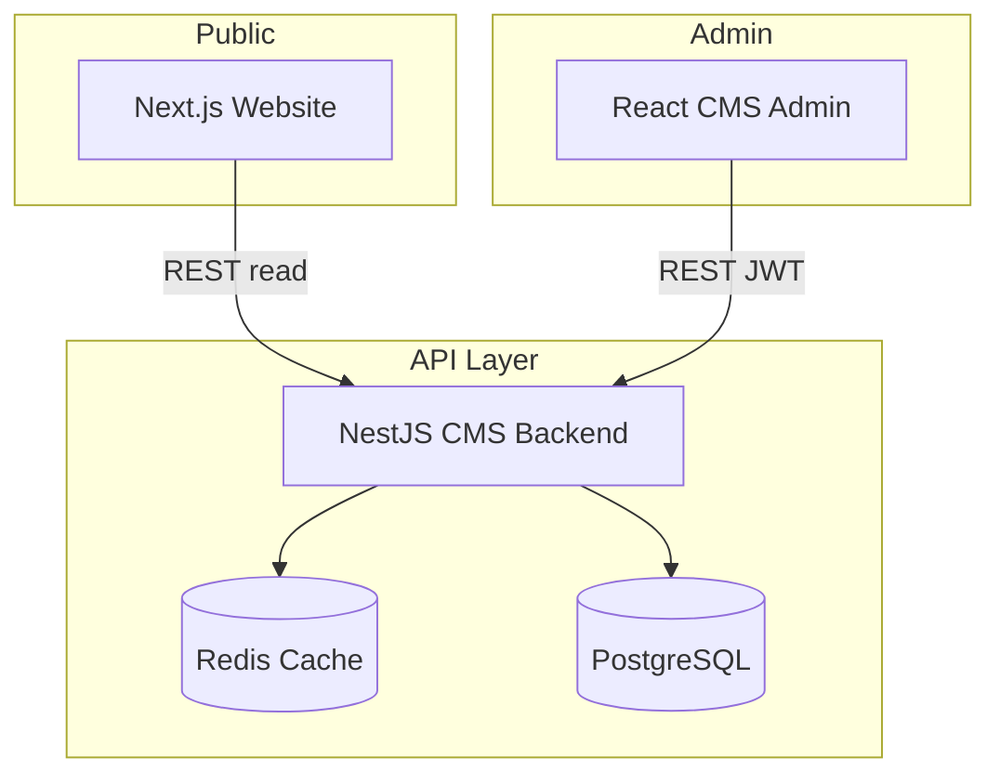

# System Architecture

## Overview

## Components

### Website (`website/`)

- Next.js 14 App Router with **dynamic catch-all** route `[[...slug]]` rendering CMS pages.
- `src/services/cms/cmsApi.ts` — typed API client with ISR revalidation.
- Server components fetch content; client components use `CmsContentProvider`.
- Section types map to React section components via `SectionRenderer`.

### CMS Backend (`cms/backend/`)

- **NestJS** modular REST API under `/api`.
- **Prisma** ORM with PostgreSQL.
- **Redis** optional cache for pages, menus, settings, content bundle.
- **JWT** access + refresh tokens, **RBAC** via roles/permissions.
- **MFA** (TOTP) via `otplib`.
- **Audit logs** for security-sensitive actions.
- **Page revisions** for versioning and restore.

### CMS Admin (`cms/admin/`)

- Vite + React + Material UI + TanStack Query.
- Dashboard, page editor with **drag-and-drop sections**, menu JSON editor, media upload.
- Tiptap-ready dependencies for rich text expansion.

### Shared (`shared/`)

- Role names, permission keys, page section types, API DTO types.

## Data flow

1. Editor updates content in Admin → `PUT /api/pages/:id/sections` → PostgreSQL.
2. Editor publishes → `POST /api/pages/:id/publish` → cache invalidation.
3. Website requests `GET /api/content/bundle` or per-page slug → Redis → DB.
4. New slug (e.g. `services/managed-soc`) is stored in CMS; website renders automatically.

## Deployment (Docker)

`docker-compose.yml` runs: PostgreSQL, Redis, CMS API, CMS Admin (Nginx static), Website (Next standalone), edge Nginx reverse proxy.

## Scalability

- Horizontal scale: stateless API replicas behind load balancer.
- Redis cluster for shared cache.
- CDN for `/uploads` and static assets.
- Read replicas for PostgreSQL reporting/search.
